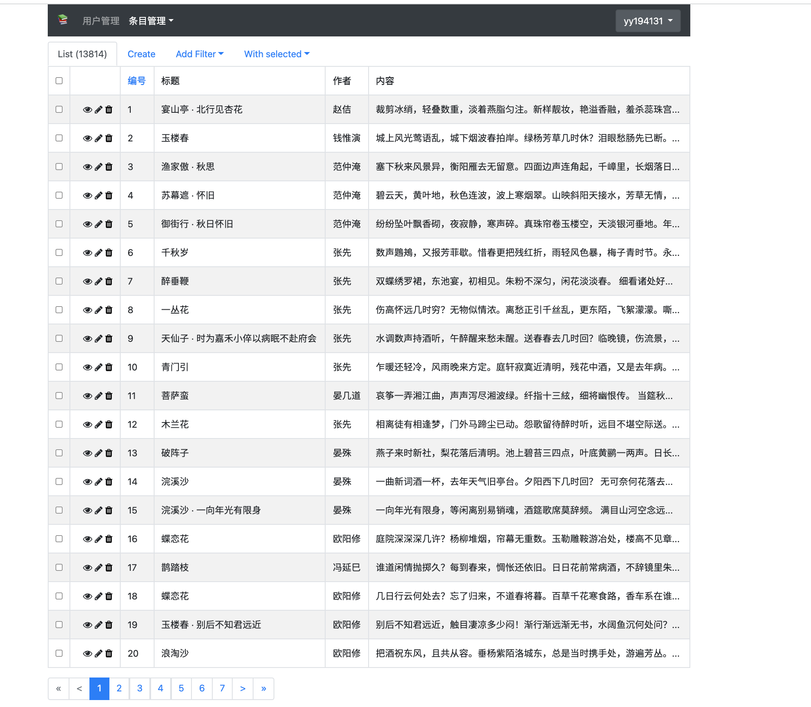

# i古诗词后台管理

如图:

在线地址: <http://igsc.admin.haihui.site/>

所有用户都可以注册帐号进行查看，如果想添加诗词内容，可以联系[@我](mailto:75124771@qq.com)添加权限。

添加的内容在`i古诗词`小程序中可见。

小程序码见下图:

欢迎扫码体验。

另见 [后端项目](https://github.com/bujnlc8/go-gsc) 及[前端项目](https://github.com/bujnlc8/igsc-wx)

如果在使用过程中有任何问题，欢迎交流讨论。
