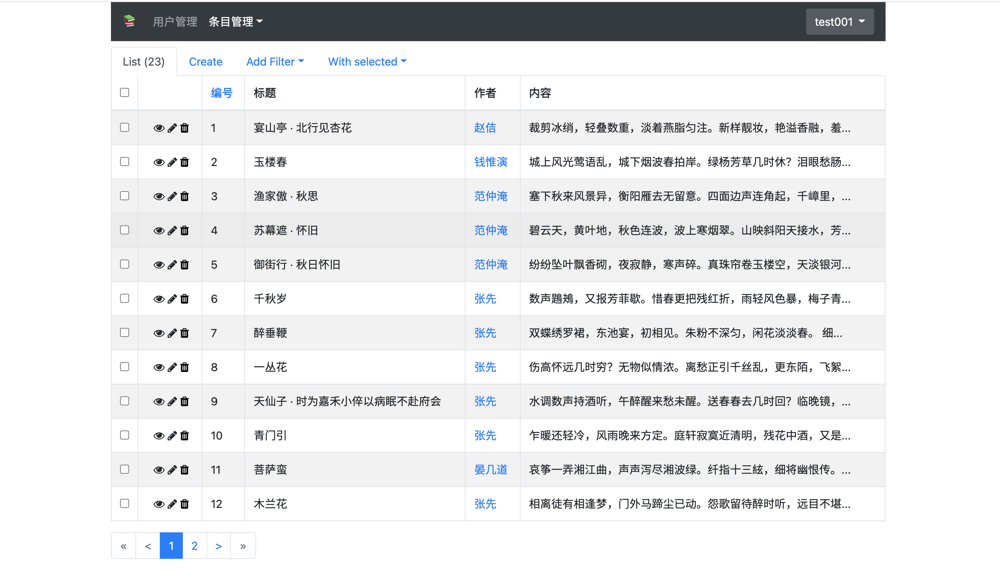

# i古诗词后台管理

如图:

在线地址: <http://igsc.admin.haihui.site/>

所有用户都可以注册帐号进行查看，也可以用用户名/密码:test001/test001登录查看。

如果想添加或完善诗词内容，可以[mail我](mailto:75124771@qq.com)添加权限。

添加的内容在`i古诗词`小程序中可见。

小程序码见下图:

欢迎扫码体验。

另见 

[后端https://github.com/bujnlc8/go-gsc](https://github.com/bujnlc8/go-gsc) 

[前端https://github.com/bujnlc8/igsc-wx](https://github.com/bujnlc8/igsc-wx)

[vim插件https://github.com/bujnlc8/vim-gsc](https://github.com/bujnlc8/vim-gsc)

如果在使用过程中有任何问题，欢迎交流讨论。
